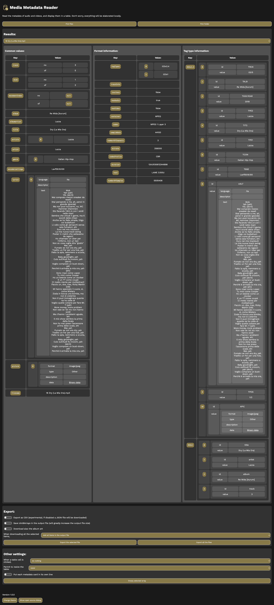

# media-metadata-reader

A website that shows all the metadata of audio and video files. No upload required – everything is elaborated in your browser.

Try it: https://dinoosauro.github.io/media-metadata-reader/

## Usage

Open the website. You'll be prompted to choose some files, but you can also drag and drop them. After you've chosen these files, you'll be able to read all the metadata of each one. You can change the file that is being viewed from the dropdown menu before the file metadata.

You'll immediately find some common metadata, that usually are available in all audio/video formats. Later, you'll find codec information, and finally you'll see the specific metadata embedded in your audio file. This last section is the one that contains eventual custom metadata, so it's suggested to look at it.

## Export
You can export the metadata either as a JSON or as a CSV (experimental) file. You can choose if you want to export a single  CSV/JSON file with all the metadata of the selected file, or if you want to create a CSV/JSON file for each audio/video.

You can also choose if you want to save binary data to the JSON/CSV file. It's suggested to leave this disabled, since it would greatly increase the output file size. However, you can also choose to download the album art of the current audio/video as a separated file, and this would use way less space than saving it in the JSON/CSV file.

Finally, you can also choose if you want to download a file or to copy the content in the clipboard every time you click on a table cell. In case it's just a string, a plain text file will be downloaded/copied. You can also choose to enable manual resizing for each table cell.

## Screenshot

Below you can find a screenshot of the webpage. Note that I've zoomed out the webpage a little so that both three cards can be displayed on one line. 

